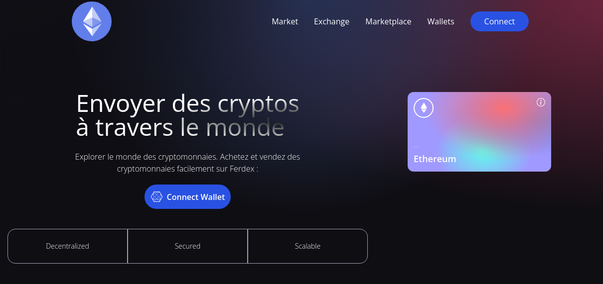

# FerDex - Web 3.0 Blockchain Application

## Introduction
This is a code repository for the web3 project build with web3 methodologies and ReactJS
Ceci est le repository d'un projet blockchain dévéloppé avec les technologies suivante :  
Solidity , hardhat ,Alchemy ,ReactJs et Metamask 
Network : Ropsten Network.

E-mail - ferdiattivi@gmail.com
